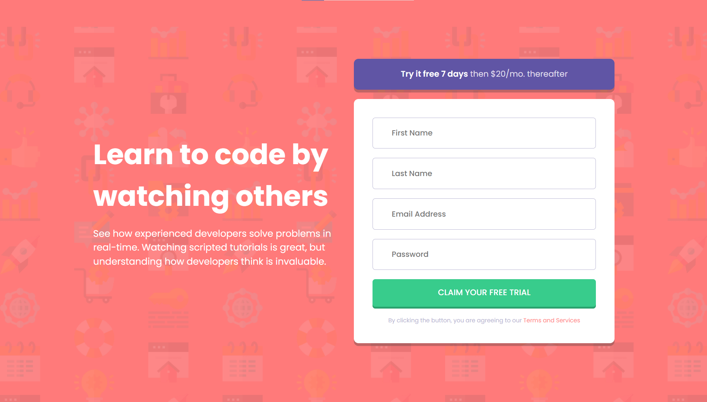

# Frontend Mentor - Intro component with sign up form solution

This is a solution to the [Intro component with sign up form challenge on Frontend Mentor](https://www.frontendmentor.io/challenges/intro-component-with-signup-form-5cf91bd49edda32581d28fd1). Frontend Mentor challenges help you improve your coding skills by building realistic projects. 

## Table of contents

- [Overview](#overview)
  - [The challenge](#the-challenge)
  - [Screenshot](#screenshot)
  - [Links](#links)
- [My process](#my-process)
  - [Built with](#built-with)
- [Author](#author)

## Overview

### The challenge

Users should be able to:

- View the optimal layout depending on their device's screen size
- See hover and focus states for interactive elements

### Screenshot

### Links

- Solution URL: [Intro component with sign up form-Solution](https://github.com/Mohan823/intro-component-with-signup-form.git)
- Live Site URL: [Intro component with sign up form-Live](https://mohan823.github.io/intro-component-with-signup-form/)

## My process

- Using Sass Css to simplify analyses in future.
- Targetting which one is most important (mobile/desktop)
- Then, I made css from sass then convert it for another devices via media queries.

### Built with
- Form Validations Client Side
- Semantic HTML5 markup
- CSS custom properties
- Flexbox
- CSS Grid
- Sass Css

## Author

- Frontend Mentor - [Mohan Krishna](https://www.frontendmentor.io/profile/Mohan823)
